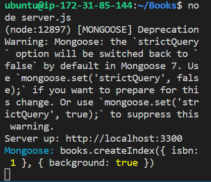

To install NodeJs, I started by updating Ubuntu `sudo apt update`
I also upgraded ubuntu using `sudo apt upgrade`

I also added certificates. 

I installed NodeJS using `sudo apt install -y nodejs`

	

I prepared ground to install mongodb. Installed mongodb using `sudo apt install -y mongodb`

Started the server using `sudo service mongodb start`

I thereafter verified the service using `sudo systemctl status mongodb`

I installed npm using `sudo apt install -y npm`

The npm made it possible to install body-parser which is needed to process JSON filed 

I created a folder called Books.

In the Books directory, I initialise npm.

I thereafter added a server.js file and configued it using already-given code.

I also installed express mongoose using `sudo npm install express mongoose`

In the Books folder< i also created a folder named apps using `mkdir apps && cd apps`

I created a file named routes.js and pasted a configuration code. 

I created a folder named models using `mkdir models && cd models`

I created a file book.js `vi book.js`. I also pasted a configuration code.

I cd into 'Books' and created a folder named public.

I also added a file named 'script.js'

I also created a file named index.html in public

I cd into books and started the server using `node server.js`

I connected the server using port 3300.

