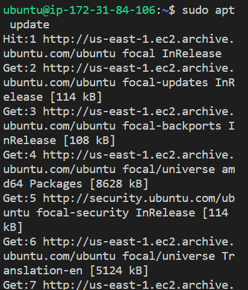
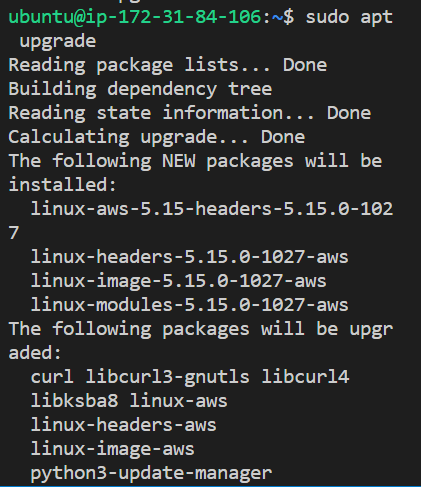
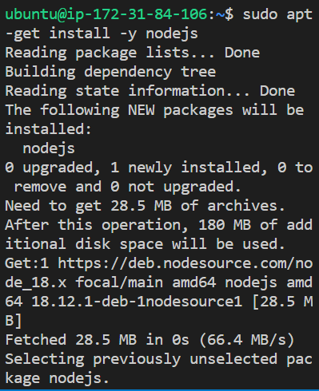
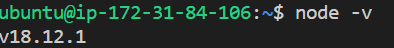
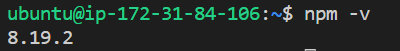
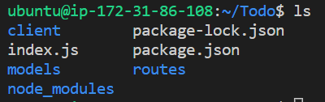
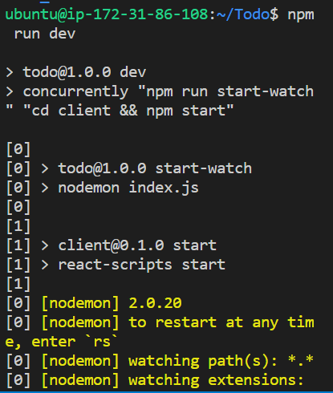
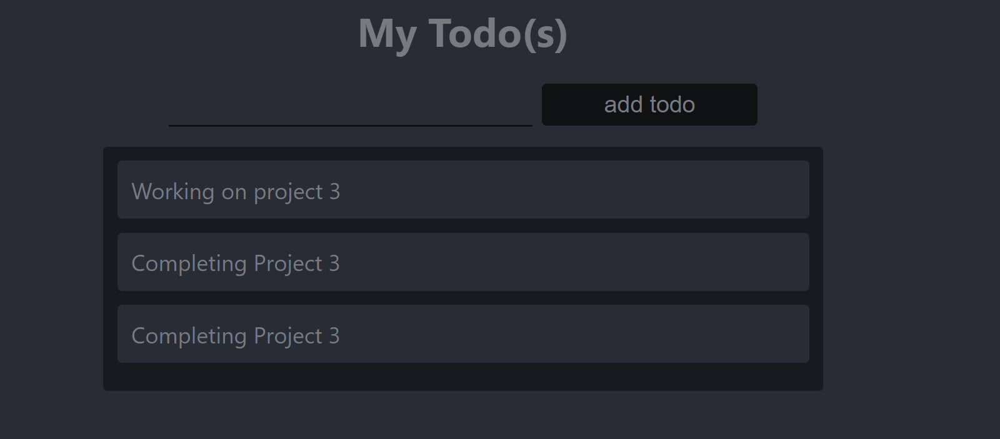

I started my backend configuration by updating ubuntu using `sudo apt update`

I upgraded ubuntu using `sudo apt upgrade`

Got the location for Node.js software on ubuntu using `curl -fsSL https://deb.nodesource.com/setup_18.x | sudo -E bash -`

Installed Node.js on the server using `sudo apt-get install -y nodejs`

I verified node installation using `node -v`

I verified node installation using `npm -v`

I thereafter created new directory for my To-Do project using `mkdir Todo`

I run `ls` to verify the Todo directory is created.

Then i changed the current directory of the newly created one using `cd Todo`

I used `npm init` to initialise the project so that I can create a new file named package.json
I thereafter run ls to confirm that I have package.json file created

The next step was to install express using `npm install express`

I created an index.js file

I installed the dotenv module using `npm install dotenv`

I entered index.js to input the configuration code.

I entered `node.js`  to see if the server was running.

I went on to my EC2 instance to edit the inbound rule to open port 5000.

Ran the public Ip:5000 to confirm. 

I thereafter created routes folder in Todo using `mkdir routes`

I cd into routes to create an api.js file.

I opened the api.js file to input code.

The next stepwas to create a model and schema that will make the application more interactive. To do this, I cd in Todo and installed mongoose using `npm install mongoose`

I thereafter created a models folder

I cd into the folder to create a todo.js file.

I opened vim todo.js to paste the configuration code.

I thereafter cd into routes, opened api.js and deleted the code inside.

I thereafter created a mongodb database on Mlab

I thereafter created a file in the Todo directory and named it .env

I added the connection string from mlab to access the database.

I thereafter updated index.js to reflect the use of .env.I deleted the code in index.js and replaced it with a .env code.

I restarted my server using `node index.js`

I thereafter proceeded to create the frontend. I started by running `npx create-react-app client`. This created a Todo directory called client.
I thereafter installed concurrently so that we can run more than one command using `npm install concurrently --save-dev`
I installed nodemon which us used to run and monitor the server `npm install nodemon --save-dev`

I opened package.json in Todo to edit the code.

I therafter cd client and opened package.json. I added "proxy": "http://localhost:5000".

I thereafter cd into Todo and used `npm run dev`

I went further to create react component. cd into client, cd into src and created the components directory.

I cd into components and created three files `touch Input.js ListTodo.js Todo.js`

I thereafter opened input.js and inputted the code.

I therafter cd to clients and installed axios

I went on to components directory and opened ListTodo.js

I thereafter pasted the code.

In Todo.js, I also pasted a code

I moved to src folder, went into App.js. I also coped a code. 

In src, I also opened App.css and pasted the code. 

In src directory, I also opened index.css. I thereafter pasted the code.

I cd into Todo and run the server using `npm run dev`

Checked the browser to see if the backend and fronend are in syn.

